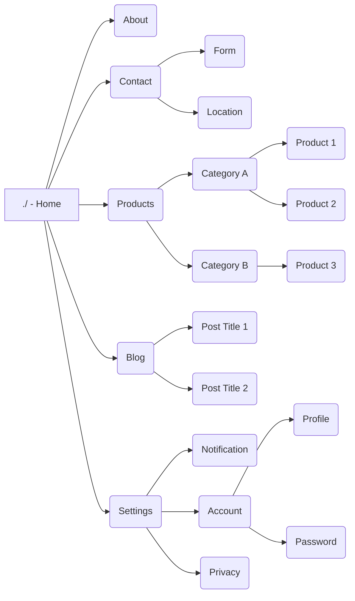

# SDLC 
- ## **Planning and Requirements**
## Mini Project Cos4101 SWE(Software Engineering)

## Objective
สร้าง website เเนะนำเเนวทางการลงทะเบียนเรียนสำหรับ CS Students

## Problem Statement
**ปัญหาที่ต้องทำ website นี้คือการลงทะเบียนเรียนของนักศึกษา CS มีทั้ง**
- ไม่รู้ว่าจะลงทะเบียนเรียนวิชาไหน 
- **solution**:
  - มี roadmap ที่เป็น default ให้กับนักศึกษา CS ทุกคน
  - มี roadmap ที่รุ่นที่เคยใช้เรียน เเล้วจบการศึกษาไปเเล้ว

- ลงข้ามวิชา พบเจอประสบปัญหาเรียนไม่เข้าใจ เพราะเรียนข้ามวิชา 
- คำอธิบายวิชาเป็นทางการ ไม่เข้าใจ ส่งผลให้ไม่รู้ว่าจะลงทะเบียนเรียนวิชาไหน
- **solution**:
  - มีรู้รายละเอียดของวิชาเรียนที่ต้องการลงทะเบียนเรียน
  - มีคำอธิบายวิชาในรูปแบบที่เข้าใจง่าย
**Optional**:
- ไม่รู้รายละเอียดของวิชาเรียนที่ต้องการลงทะเบียนเรียน ก่อนที่จะลงทะเบียนเรียน เผื่อคนที่มีพื้นฐานอยู่เเล้ว เเต่อยากเรียนข้ามขั้นวิชา

## Software Requirements Engineering Process

- ### inception
  - **Stakeholders**: นักศึกษา CS, อาจารย์
  - **Goals**:
    - สร้าง roadmap เเนะนำการลงทะเบียนเรียนที่เข้าใจง่าย
    - ให้ข้อมูลวิชาเรียนที่ชัดเจน
  - **Scope**:
    - สร้าง website ที่มี roadmap เเละข้อมูลวิชาเรียน
  - **Constraints**:
    - ต้องสามารถเข้าถึงได้ง่าย
    - ต้องมีข้อมูลที่ถูกต้องและเป็นปัจจุบัน
  - **Assumptions**:
    - นักศึกษา CS ต้องการข้อมูลที่ชัดเจนและเข้าใจง่าย
    - อาจารย์ต้องการให้ข้อมูลวิชาเรียนที่ถูกต้องและเป็นปัจจุบัน
  - **Risks**:
    - ข้อมูลวิชาเรียนอาจไม่ถูกต้องหรือไม่เป็นปัจจุบัน
    - นักศึกษาอาจไม่เข้าใจ roadmap ที่สร้างขึ้น
  - **Feasibility Study**:
    - การสร้าง website นี้เป็นไปได้ เนื่องจากมีข้อมูลวิชาเรียนที่สามารถนำมาใช้ได้
    - การสร้าง roadmap ที่เข้าใจง่ายเป็นไปได้ เนื่องจากมีข้อมูลที่สามารถนำมาใช้ได้
  - **Stakeholder Analysis**:
    - นักศึกษา CS: ต้องการข้อมูลที่ชัดเจนและเข้าใจง่าย
    - อาจารย์: ต้องการให้ข้อมูลวิชาเรียนที่ถูกต้องและเป็นปัจจุบัน

- ### Elaboration
  - **Requirements Elicitation**:
    - สัมภาษณ์นักศึกษา CS เพื่อทราบความต้องการในการลงทะเบียนเรียน
    - สัมภาษณ์อาจารย์เพื่อทราบข้อมูลวิชาเรียนที่ต้องการให้แสดงใน website
  - **Requirements Analysis**:
    - นักศึกษา CS ต้องการ roadmap ที่เข้าใจง่าย
    - นักศึกษา CS ต้องการข้อมูลวิชาเรียนที่ชัดเจน
    - อาจารย์ต้องการให้ข้อมูลวิชาเรียนที่ถูกต้องและเป็นปัจจุบัน

## ภาพรวมเส้นทางของ สร้าง website เเนะนำเเนวทางการลงทะเบียนเรียนสำหรับ CS Students

## หมายเหตุ
  - รอการเเก้ไข เเละตัวอย่างการใช้งาน
  - [ ] Task item description
  - [x] Completed task item description

- ## **Analysis Model**
  - **Use Case Diagram**:
    - สร้าง Use Case Diagram เพื่อแสดงความสัมพันธ์ระหว่างนักศึกษา CS, อาจารย์ และ website
  - **Class Diagram**:
    - สร้าง Class Diagram เพื่อแสดงโครงสร้างของ website และข้อมูลที่เกี่ยวข้อง
  - **Sequence Diagram**:
    - สร้าง Sequence Diagram เพื่อแสดงลำดับการทำงานของ website
  - **State Diagram**:
    - สร้าง State Diagram เพื่อแสดงสถานะต่างๆ ของ website
  - **Activity Diagram**:
    - สร้าง Activity Diagram เพื่อแสดงกระบวนการทำงานของ website
  - **Data Flow Diagram**:
    - สร้าง Data Flow Diagram เพื่อแสดงการไหลของข้อมูลภายใน website

- **Design**
  - **Architectural Design**:
    - กำหนดสถาปัตยกรรมของ website เช่น การใช้ MVC (Model-View-Controller) หรือ Microservices
  - **User Interface Design**:
    - ออกแบบ UI ของ website ให้ใช้งานง่ายและเข้าถึงข้อมูลได้สะดวก
  - **Database Design**:
    - ออกแบบฐานข้อมูลเพื่อเก็บข้อมูลวิชาเรียน, roadmap, และข้อมูลอื่นๆ ที่เกี่ยวข้อง
  - **Component Design**:
    - กำหนดส่วนประกอบต่างๆ ของ website เช่น โมดูลสำหรับการแสดง roadmap, โมดูลสำหรับการแสดงข้อมูลวิชาเรียน
  - **Interface Design**:
    - กำหนดอินเตอร์เฟสระหว่างส่วนประกอบต่างๆ ของ website เช่น อินเตอร์เฟสระหว่างโมดูลการแสดง roadmap และโมดูลการแสดงข้อมูลวิชาเรียน