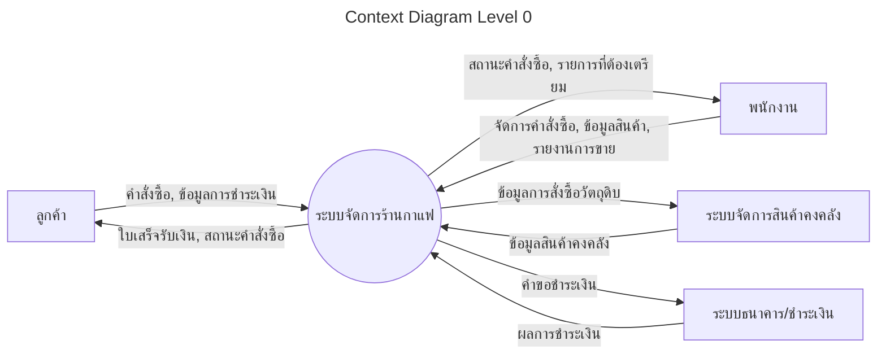
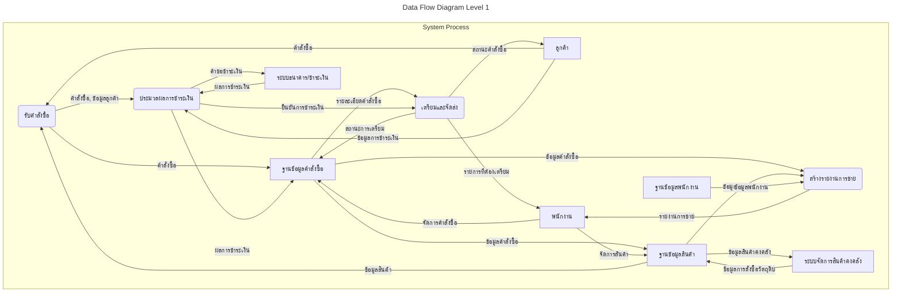
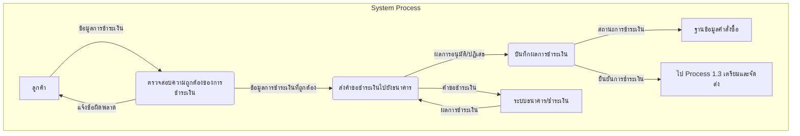

```mermaid
---
title: Context Diagram Level 0
---
graph LR
    A[ลูกค้า] -->|คำสั่งซื้อ, ข้อมูลการชำระเงิน| B((ระบบจัดการร้านกาแฟ))
    B -->|ใบเสร็จรับเงิน, สถานะคำสั่งซื้อ| A
    C[พนักงาน] -->|จัดการคำสั่งซื้อ, ข้อมูลสินค้า, รายงานการขาย| B
    B -->|สถานะคำสั่งซื้อ, รายการที่ต้องเตรียม| C
    D[ระบบจัดการสินค้าคงคลัง] -->|ข้อมูลสินค้าคงคลัง| B
    B -->|ข้อมูลการสั่งซื้อวัตถุดิบ| D
    E[ระบบธนาคาร/ชำระเงิน] -->|ผลการชำระเงิน| B
    B -->|คำขอชำระเงิน| E
```

```mermaid
---
title: Data Flow Diagram Level 1
---
graph TD
    subgraph subgraph My Bounding Box [System Process]
        1.1(รับคำสั่งซื้อ) -->|คำสั่งซื้อ, ข้อมูลลูกค้า| 1.2(ประมวลผลการชำระเงิน)
        1.1 -->|คำสั่งซื้อ| D1[ฐานข้อมูลคำสั่งซื้อ]
        D1 -->|รายละเอียดคำสั่งซื้อ| 1.3(เตรียมและจัดส่ง)
        1.2 -->|ผลการชำระเงิน| D1
        1.2 -->|ยืนยันการชำระเงิน| 1.3
        1.3 -->|สถานะการเตรียม| D1
        1.3 -->|สถานะคำสั่งซื้อ| A[ลูกค้า]
        1.3 -->|รายการที่ต้องเตรียม| C[พนักงาน]
        D1 -->|ข้อมูลคำสั่งซื้อ| 1.4(สร้างรายงานการขาย)
        D2[ฐานข้อมูลสินค้า] -->|ข้อมูลสินค้า| 1.1
        D2 -->|ข้อมูลสินค้า| 1.4
        D3[ฐานข้อมูลพนักงาน] -->|ข้อมูลพนักงาน| 1.4
        D1 -->|ข้อมูลคำสั่งซื้อ| D2
        1.4 -->|รายงานการขาย| C
        1.2 -->|คำขอชำระเงิน| E[ระบบธนาคาร/ชำระเงิน]
        D2 -->|ข้อมูลสินค้าคงคลัง| D[ระบบจัดการสินค้าคงคลัง]
    end
        A[ลูกค้า] -->|คำสั่งซื้อ| 1.1
        A[ลูกค้า] -->|ข้อมูลการชำระเงิน| 1.2
        E[ระบบธนาคาร/ชำระเงิน] -->|ผลการชำระเงิน| 1.2
        C[พนักงาน] -->|จัดการสินค้า| D2
        C[พนักงาน] -->|จัดการคำสั่งซื้อ| D1
        D[ระบบจัดการสินค้าคงคลัง] -->|ข้อมูลการสั่งซื้อวัตถุดิบ| D2

    %% style 1.1 fill:#f9f,stroke:#333,stroke-width:2px
    %% style 1.2 fill:#f9f,stroke:#333,stroke-width:2px
    %% style 1.3 fill:#f9f,stroke:#333,stroke-width:2px
    %% style 1.4 fill:#f9f,stroke:#333,stroke-width:2px
```

```mermaid
---
DFD Level 2: Detail of "Process Payment"
---
graph TD
    subgraph subgraph subgraph My Bounding Box [System Process]
        A[ลูกค้า] -->|ข้อมูลการชำระเงิน| 2.1(ตรวจสอบความถูกต้องของการชำระเงิน)
        2.1 -->|ข้อมูลการชำระเงินที่ถูกต้อง| 2.2(ส่งคำขอชำระเงินไปยังธนาคาร)
        2.1 -->|แจ้งข้อผิดพลาด| A
        2.2 -->|ผลการอนุมัติ/ปฏิเสธ| 2.3(บันทึกผลการชำระเงิน)
        2.2 -->|คำขอชำระเงิน| E[ระบบธนาคาร/ชำระเงิน]
        E[ระบบธนาคาร/ชำระเงิน] -->|ผลการชำระเงิน| 2.2
        2.3 -->|สถานะการชำระเงิน| D1[ฐานข้อมูลคำสั่งซื้อ]
        2.3 -->|ยืนยันการชำระเงิน| F[ไป Process 1.3 เตรียมและจัดส่ง]
    end

    %% style 2.1 fill:#f9f,stroke:#333,stroke-width:2px
    %% style 2.2 fill:#f9f,stroke:#333,stroke-width:2px
    %% style 2.3 fill:#f9f,stroke:#333,stroke-width:2px
```